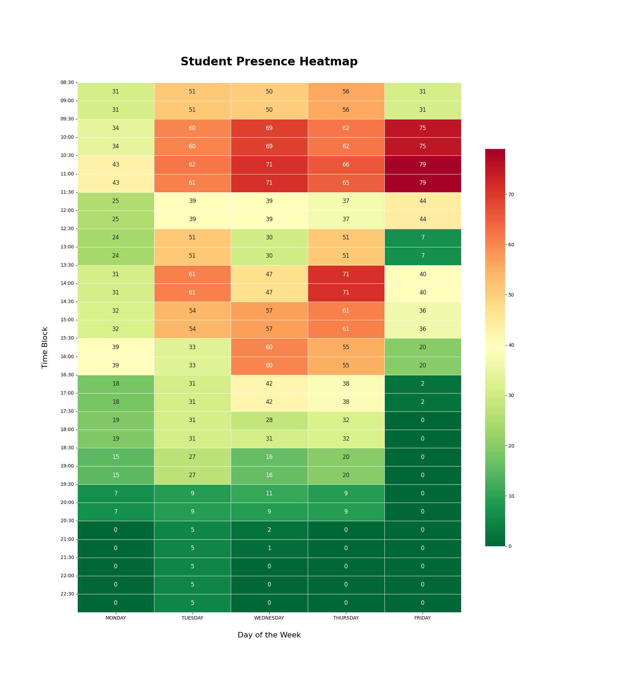

# Program Presence Heatmap Analysis

## Problem Statement

The goal of this project was to analyze timesheet data from various programs at Sault College to determine the peak hours when the most programs have classes on campus simultaneously. The timesheets are provided in PDF format and contain varying structures. The final output should be a heatmap that visually represents program presence across different time blocks throughout the week, with color coding to indicate low, medium, and high program density. It also includes information about the total number of programs included in the analysis.



## Approach

### 1. **Data Extraction:**
   - The timesheets are provided in PDF format, each containing the schedule for different programs at the college.
   - We used `pdfplumber` to extract relevant data such as day of the week, start time, end time, and course information from the PDFs.
   - The data extraction function loops through each PDF, identifying the day of the week and the time intervals during which classes are held.

### 2. **Data Processing:**
   - The extracted data is structured into a pandas DataFrame with columns for `Day` and `Time Block`.
   - Every 30-minute interval between the start and end times of each class is recorded to accurately reflect program presence.
   - A categorical column is used to ensure the days of the week and time blocks are ordered correctly.

### 3. **Heatmap Generation:**
   - We created a list of all possible 30-minute time blocks in a day (e.g., from 08:00 to 22:30).
   - The data is then grouped and counted to generate a heatmap, where each cell represents a 30-minute interval for a specific day.
   - The heatmap is generated using `seaborn`, with color coding to represent the density of programs during each interval (i.e., the number of programs that have classes at that time).

### 4. **Colorbar and Program Count Information**:
   - The colorbar on the side of the heatmap includes labels explaining that the colors represent the number of programs with classes. "More Programs" corresponds to more programs having classes in that time block, while "Fewer Programs" represents fewer programs with classes.
   - The heatmap includes a population sample annotation, dynamically showing the total number of programs (calculated as the number of PDF files processed).
   - The total number of programs included in the analysis is provided on the heatmap and also saved in the accompanying Excel file.

### 5. **Alignment Issues:**
   - Ensuring that the Y-axis labels (time blocks) were correctly aligned with the start of each cell on the heatmap was a key challenge.
   - By setting precise Y-tick positions using `np.arange(len(time_blocks))`, the time labels align perfectly with the start of each corresponding cell.

### 6. **Final Output:**
   - The final heatmap shows the distribution of program presence across the week.
   - The output is saved as a PNG image (`heatmap_with_programs.png`) and also exported to an Excel file for further analysis.
   - The Excel file (`weekly_schedule_heatmap_with_programs.xlsx`) contains the heatmap data and a list of all programs included in the analysis.

## How to Run the Code

### Prerequisites

Ensure you have the following Python packages installed:

```bash
pip install pdfplumber pandas seaborn matplotlib numpy
```

### Running the Code

1. **Place the Timesheets in the Folder:**
   - Place all the timesheet PDFs in a folder named `timesheets`.

2. **Run the Script:**
   - Use the provided script to extract data and generate the heatmap.

   ```python
   python your_script_name.py
   ```

3. **View the Results:**
   - The script will generate a `heatmap_with_programs.png` file and save it in the working directory.
   - An Excel file `weekly_schedule_heatmap_with_programs.xlsx` will also be created, containing the heatmap data and a list of the included programs.

### Code Explanation

The key components of the code are:

- **Data Extraction:**
  - The `extract_data_from_pdf` function processes each PDF file and extracts the relevant schedule data, including program names, day, and time blocks.

- **Data Structuring:**
  - The extracted data is stored in a pandas DataFrame, where each row represents a 30-minute interval during which a class is in session for a specific program.

- **Heatmap Generation:**
  - The data is aggregated and visualized using a heatmap, with adjustments to ensure that time blocks align correctly with the cells.

- **Program Count Information**:
  - The heatmap visualizes the number of programs with classes at specific times, not individual student counts. The color scale and labels on the sidebar indicate the relative density of programs during each time block.

- **Y-Axis Alignment**:
  - Special care is taken to ensure that the time labels on the Y-axis align with the start of each cell, enhancing readability.

- **Excel Export**:
  - The final output is exported to an Excel file containing the heatmap data and a list of the programs that were included in the analysis.

### Notes:
- The heatmap doesn't display the number of students; rather, it represents the number of programs that have scheduled classes at those times.
- The list of included programs can be found in the Excel output, making it clear which programs were analyzed.